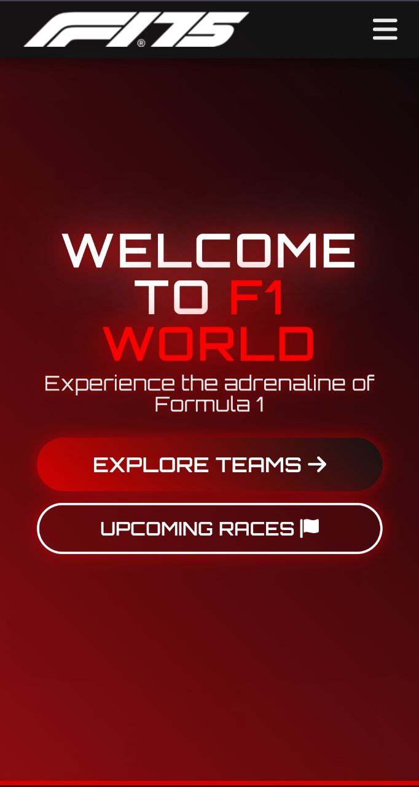
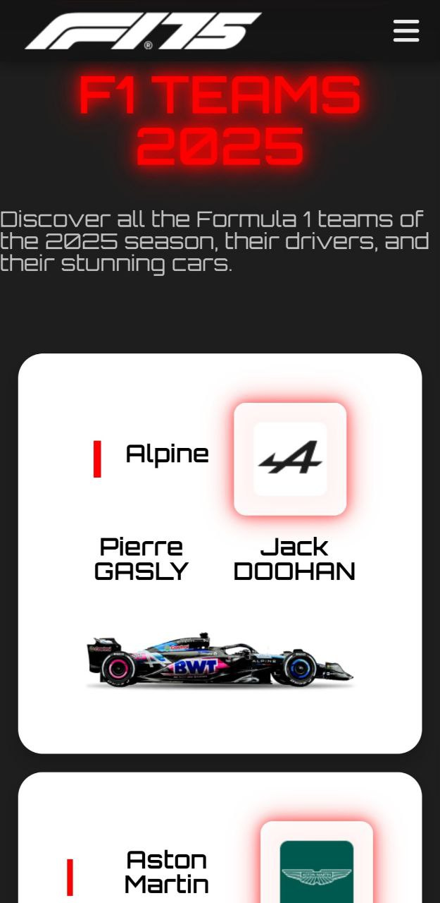
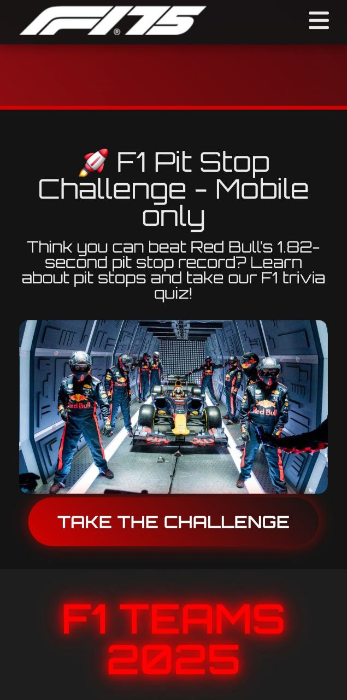

# F1 World - Formula 1 Interactive Website

---

## 1. Introduction

This project is a **Formula 1 interactive website**, designed as part of a laboratory assignment. The website presents detailed information about **Formula 1 teams, drivers, upcoming races, history, and contact details**. The goal of this project is to create a **modern, visually appealing, and interactive** experience for F1 enthusiasts using web technologies.

The project was deployed using vercel: https://pweb-lab-2.vercel.app/

---

## 2. Features

### 2.1 Hero Section
- A visually striking introduction with animations.
- Call-to-action buttons leading to key sections.

### 2.2 Teams Section
- Showcases **all 2025 Formula 1 teams**.
- Displays drivers, team logos, and car images.
- Interactive hover effects and animations.

### 2.3 Upcoming Races
- Displays the **official 2025 F1 race calendar**.
- Race dates, locations, and track outlines.
- A dynamic grid layout for better user experience.

### 2.4 Driver Profiles
- Individual driver sections with images and career highlights.
- Accordion-style fact display with hover animations.

### 2.5 F1 History
- A timeline-based approach to highlight major events in Formula 1 history.
- Uses **structured layouts and animations** for better readability.

### 2.6 Contact Section
- Provides contact details and a form for user inquiries.
- Features styled input fields and a submit button.

---

# 3. Laboratory Work Nr. 3 - Mobile Adaptation & Mascot

## 3.1 Mobile-Friendly Improvements
- **Hero Section Scaling:** Adjusted text size, buttons, and overall layout to fit smaller screens properly.
- **Teams Grid:** Changed from **2 teams per row** to **1 team per row** on mobile for better readability.
- **Contact Section:** Adjusted contact info layout to prevent text from overflowing and stacking improperly.
- **Navigation Bar:** Implemented a **hamburger menu** that appears on mobile screens, replacing the default horizontal menu.

## 3.2 Mobile-Only "Pit Stop Quiz" Section
To enhance the experience for mobile users, a **special mobile-only section** was added just after the **hero section**. This interactive section engages users by challenging them with a **Formula 1 pit stop reaction quiz**.

## 3.3 Website Mascot Implementation
To make the website more interactive, a mascot named **Turbo** was added. Turbo is a **Formula 1-inspired animated character** that appears in the bottom-left corner after a short delay.

### 🚀 **Turbo's Features**
- ✅ **Appears with a delay** after 3 seconds.
- ✅ **Displays a dynamic welcome message** when hovered.
- ✅ **Animated movements** (tilting, jumping).
---

## Screenshots
### Hero Section

### Teams Section

### Driver Profiles

### Upcoming Races

### History Section

### Contact Form

### Hero Section (Mobile)

### Teams Section (Mobile Grid)

### Pit Stop Quiz (Mobile-Only)

### Turbo - F1 Mascot

