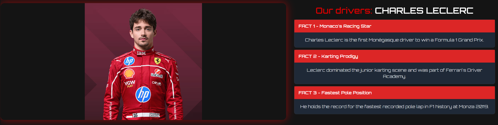

# F1 World - Formula 1 Interactive Website

## 1. Introduction

This project is a **Formula 1 interactive website**, designed as part of a laboratory assignment. The website presents detailed information about **Formula 1 teams, drivers, upcoming races, history, and contact details**. The goal of this project is to create a **modern, visually appealing, and interactive** experience for F1 enthusiasts using web technologies.

## 2. Features

### 2.1 Hero Section
- A visually striking introduction with animations.
- Call-to-action buttons leading to key sections.

### 2.2 Teams Section
- Showcases **all 2025 Formula 1 teams**.
- Displays drivers, team logos, and car images.
- Interactive hover effects and animations.

### 2.3 Upcoming Races
- Displays the **official 2025 F1 race calendar**.
- Race dates, locations, and track outlines.
- A dynamic grid layout for better user experience.

### 2.4 Driver Profiles
- Individual driver sections with images and career highlights.
- Accordion-style fact display with hover animations.

### 2.5 F1 History
- A timeline-based approach to highlight major events in Formula 1 history.
- Uses **structured layouts and animations** for better readability.

### 2.6 Contact Section
- Provides contact details and a form for user inquiries.
- Features styled input fields and a submit button.

## Screenshots
### Hero Section

### Teams Section

### Driver Profiles

### Upcoming Races

### History Section

### Contact Form

